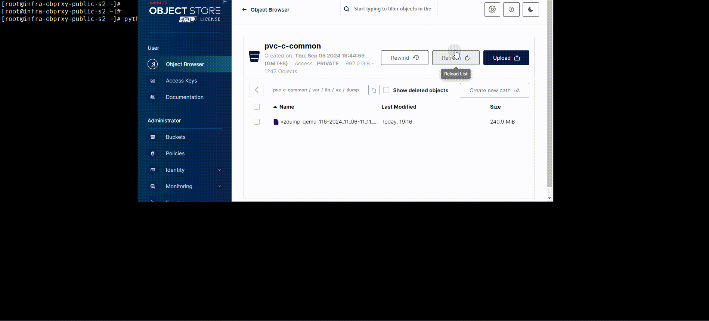
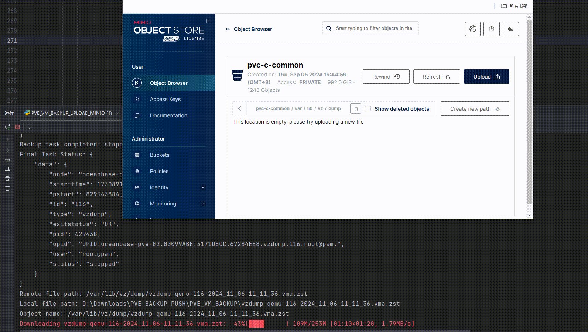

# PVE KVM automatic backup

## A. Install pip in advance. If it has already been installed, please ignore this step

`If you use Windows system to execute, install Python environment yourself`

```bash
wget https://bootstrap.pypa.io/pip/3.7/get-pip.py
apt install distutils python3-distutils -y
python3 get-pip.py
/usr/bin/python3 -m pip install --upgrade pip
```

## B. Install necessary modules

```bash
pip install -r requirements.txt

# bcrypt module version lower than 4.1.1
bcrypt==4.1.1 or bcrypt==4.0.1
```

## C. Modify the config.json configuration file

- Configuration parameter description:

| parameter         | Example Value              | describe                                                     |
| ----------------- | -------------------------- | ------------------------------------------------------------ |
| pve_url           | https://IP:8006/api2/json  | IP address of the Proxmox VE API                             |
| username          | root@pam                   | Proxmox VE authenticated username                            |
| password          | Password                   | Password for Proxmox VE authentication.                      |
| node              | oceanbase-pve-02           | The name of the Proxmox VE node where the VM is located      |
| ids               | [116, 9003, 9004] or [116] | ID of the virtual machine to be backed up                    |
| ip                | 10.21.8.14                 | IP address of the Proxmox VE node                            |
| pve_username      | root                       | Username for connecting to the Proxmox VE node via SSH       |
| pve_password      | Password                   | The password used to connect to the Proxmox VE node via SSH. |
| minio_endpoint    | https://my.domain.com      | The endpoint URL of the MinIO service.                       |
| minio_access_key  | access_key                 | The access key for the MinIO service.                        |
| minio_secret_key  | secret_key                 | The secret key for the MinIO service.                        |
| minio_bucket_name | pve-c-common               | The name of the MinIO bucket.                                |
| minio_region      | ssd-d1                     | The region where the MinIO bucket is located.                |

```bash
{
    "pve_url": "https://IP:8006/api2/json",
    "username": "root@pam",
    "password": "Password",
    "backups": [
        {
            "node": "hostname",
            "ids": [116, 9003, 9004],
            "ip": "IP"
        },
        {
            "node": "hostname",
            "ids": [101, 9001, 112],
            "ip": "IP"
        }
    "pve_username": "root",
    "pve_password": "Password",
    "minio_endpoint": "https://my.domain.com",
    "minio_access_key": "access_key",
    "minio_secret_key": "secret_key",
    "minio_bucket_name": "pvc-c-common",
    "minio_region": "ssd-d1"
}
```

## D. Execute automatic backup script

```bash
python3 PVE_VM_BACKUP_UPLOAD_MINIO.py
```

- **Download and upload speeds using the internal network**
  - **20241106191720_rec_.gif**



- **Download and upload speeds using tunneling**

  - **20241106191250_rec_.gif**



